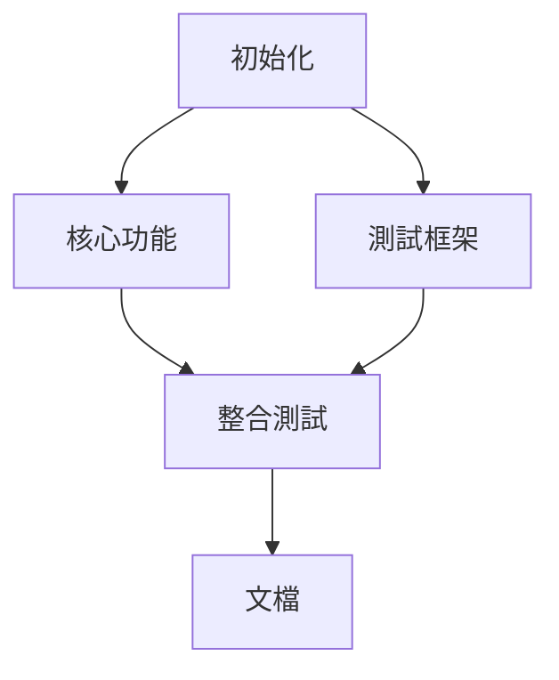

查看工作流狀態。

## 基本用法

```
/status              # 當前工作流狀態
/status --list       # 歷史工作流列表
/status --dag        # 任務依賴圖（Mermaid）
```

## 狀態來源

讀取 `.claude/workflow/current.json`：
```json
{
  "workflow_id": "workflow-{timestamp}-{topic}",
  "stage": "RESEARCH|PLAN|TASKS|IMPLEMENT|REVIEW|VERIFY",
  "status": "in_progress|completed|failed",
  "started_at": "ISO8601",
  "updated_at": "ISO8601",
  "agents": []
}
```

## 輸出格式

### 當前狀態

```
╭───────────────────────────────────────────────╮
│  📊 Workflow Status                           │
╰───────────────────────────────────────────────╯

Workflow: workflow-20260126-feature-auth
Stage: IMPLEMENT [████████░░] 80%
Status: in_progress

Agents:
  ✅ main_agent (completed)
  ⏳ tdd-enforcer (in_progress)
  ⏸️ security-auditor (pending)
  ⏸️ maintainer (pending)

Last updated: 2026-01-26 14:30:00
```

### DAG 視圖



## Flags

- `--list` - 顯示歷史工作流
- `--dag` - 顯示任務依賴圖
- `--json` - JSON 格式輸出
- `--verbose` - 詳細輸出

$ARGUMENTS
