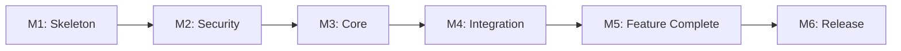

# Clawdbot MVP 里程碑規劃

**版本**: 1.0
**日期**: 2026-01-27

---

## 里程碑總覽

```
Week 1      Week 2      Week 3      Week 4      Week 5      Week 6      Week 7
  │           │           │           │           │           │           │
  ▼           ▼           ▼           ▼           ▼           ▼           ▼
┌─────┐    ┌─────┐    ┌─────────────────┐    ┌─────┐    ┌─────┐    ┌─────┐
│ M1  │───▶│ M2  │───▶│       M3        │───▶│ M4  │───▶│ M5  │───▶│ M6  │
│Skel.│    │Sec. │    │     Core        │    │Integ│    │Feat.│    │Rel. │
└─────┘    └─────┘    └─────────────────┘    └─────┘    └─────┘    └─────┘
```

---

## M1: Skeleton

**週次**: Week 1
**估算工時**: 38 小時
**目標**: 專案基礎建設完成

### 交付物

| 交付物 | 驗收標準 |
|--------|---------|
| 專案結構 | 目錄結構符合設計 |
| 配置系統 | 可載入 YAML 配置 |
| CI/CD | GitHub Actions 通過 |
| 開發環境 | 本地可啟動 |

### 任務清單

- [ ] 初始化 pnpm 專案
- [ ] 配置 TypeScript (tsconfig.json)
- [ ] 配置 ESLint + Prettier
- [ ] 建立目錄結構
- [ ] 實作配置 Schema (Zod)
- [ ] 實作配置載入器
- [ ] 設定 GitHub Actions CI
- [ ] 建立開發環境 Docker

### 驗收檢查

```bash
# 驗收命令
pnpm build          # 建置成功
pnpm lint           # 無錯誤
pnpm test           # 測試通過
pnpm start          # 可啟動（空殼）
```

---

## M2: Security

**週次**: Week 2
**估算工時**: 58 小時
**目標**: 權限系統完成

### 交付物

| 交付物 | 驗收標準 |
|--------|---------|
| Allowlist | 可配置、可查詢 |
| DM Pairing | 配對流程可用 |
| PermissionChecker | 集中化檢查 |
| AuditLogger | 日誌可寫入 |

### 任務清單

- [ ] 實作 Allowlist 管理
  - [ ] 載入配置
  - [ ] 用戶查詢 (O(1))
  - [ ] 權限判斷
- [ ] 實作 DM Pairing
  - [ ] 配對碼生成
  - [ ] 驗證流程
  - [ ] 配對狀態存儲
- [ ] 實作 PermissionChecker
  - [ ] 集中化入口
  - [ ] 快速失敗機制
  - [ ] Policy 檢查
- [ ] 實作 AuditLogger
  - [ ] JSONL 寫入
  - [ ] 自動 redact
  - [ ] Retention 機制
- [ ] 安全測試
  - [ ] 權限繞過測試
  - [ ] 注入測試

### 驗收檢查

```bash
# 驗收命令
pnpm test:security  # 安全測試 100% 通過

# 手動驗收
# 1. 配置 allowlist
# 2. 非 allowlist 用戶被拒絕
# 3. 配對流程正常
# 4. 審計日誌有記錄
```

### 安全驗收標準

| 檢查項 | 通過標準 |
|--------|---------|
| 權限邏輯 | 無分散檢查 |
| 測試覆蓋 | 權限模組 100% |
| 日誌完整 | 所有決策有記錄 |
| 敏感資訊 | 無硬編碼 |

---

## M3: Core

**週次**: Week 3-4
**估算工時**: 75 小時
**目標**: Claude Code 整合完成

### 交付物

| 交付物 | 驗收標準 |
|--------|---------|
| Claude Adapter | 可調用 Claude Code |
| Tool API | HTTP 端點可用 |
| Response Streaming | 可串流回覆 |
| Session 管理 | 上下文正確傳遞 |

### 任務清單

Week 3:
- [ ] 設計 Adapter 介面
- [ ] 實作 subprocess spawn
- [ ] 實作輸出解析
- [ ] 實作 Tool API HTTP 端點

Week 4:
- [ ] 實作 Response Streaming
- [ ] 實作 Session Context
- [ ] 實作錯誤處理
- [ ] 整合測試

### 驗收檢查

```bash
# 驗收命令
pnpm test:integration  # 整合測試通過

# 手動驗收
curl -X POST http://localhost:3000/api/process \
  -H "Content-Type: application/json" \
  -d '{"message": "Hello", "userId": "123"}'
# 應返回 Claude Code 回覆
```

### 技術驗收標準

| 檢查項 | 通過標準 |
|--------|---------|
| API 調用 | 成功調用 Claude Code |
| 回覆時間 | < 15s (P95) |
| 錯誤處理 | 無未捕獲異常 |
| Tool 調用 | 工具可正確回調 |

---

## M4: Integration

**週次**: Week 5
**估算工時**: 46 小時
**目標**: Telegram Bot 上線

### 交付物

| 交付物 | 驗收標準 |
|--------|---------|
| Grammy Bot | Long Polling 運作 |
| 消息處理 | 可處理文字訊息 |
| 命令處理 | /start, /pair, /help |
| Typing 控制 | 顯示「正在輸入」 |

### 任務清單

- [ ] Grammy Bot 設定
  - [ ] Token 配置
  - [ ] Long Polling 設定
  - [ ] 錯誤處理
- [ ] 消息處理器
  - [ ] 文字訊息
  - [ ] 整合 PermissionChecker
  - [ ] 整合 ClaudeAdapter
- [ ] 命令處理器
  - [ ] /start
  - [ ] /pair
  - [ ] /help
  - [ ] /status
  - [ ] /reset
- [ ] Typing 控制
  - [ ] Heartbeat 機制
  - [ ] 進度提示

### 驗收檢查

```bash
# 驗收命令
pnpm start  # Bot 啟動

# 手動驗收（Telegram）
# 1. 發送 /start → 收到歡迎訊息
# 2. 發送 /pair → 配對流程正常
# 3. 發送訊息 → 收到 AI 回覆
# 4. 發送訊息時 → 顯示「正在輸入」
```

---

## M5: Feature Complete

**週次**: Week 6
**估算工時**: 63 小時
**目標**: 所有功能完成

### 交付物

| 交付物 | 驗收標準 |
|--------|---------|
| Session Store | 可讀寫 Session |
| Transcript Store | 可記錄對話 |
| CLI 工具 | start, config check |
| 文檔 | README, 架構文檔 |

### 任務清單

- [ ] Session Store
  - [ ] JSON 讀寫
  - [ ] 檔案鎖定
  - [ ] 清理機制
- [ ] Transcript Store
  - [ ] JSONL 追加
  - [ ] 讀取歷史
- [ ] CLI 工具
  - [ ] start 命令
  - [ ] config check 命令
  - [ ] status 命令
- [ ] 文檔
  - [ ] README.md
  - [ ] architecture.md
  - [ ] deployment.md

### 驗收檢查

```bash
# 驗收命令
clawdbot config check  # 配置驗證通過
clawdbot start         # Bot 啟動

# 功能檢查
# 1. Session 重啟後保留
# 2. Transcript 可查詢
# 3. CLI 友善輸出
```

---

## M6: Release

**週次**: Week 7
**估算工時**: 58 小時
**目標**: 生產就緒

### 交付物

| 交付物 | 驗收標準 |
|--------|---------|
| E2E 測試 | 核心流程通過 |
| 效能測試 | 符合 SLA |
| 安全測試 | 無高危漏洞 |
| 部署指南 | 可依指南部署 |

### 任務清單

- [ ] E2E 測試
  - [ ] 配對流程
  - [ ] 對話流程
  - [ ] 錯誤處理
- [ ] 效能測試
  - [ ] 負載測試
  - [ ] 回覆延遲測試
- [ ] 安全測試
  - [ ] 權限測試
  - [ ] 注入測試
  - [ ] 依賴審計
- [ ] 部署準備
  - [ ] Docker 映像
  - [ ] 部署指南
  - [ ] 維運文檔

### 驗收檢查

```bash
# 驗收命令
pnpm test:e2e          # E2E 測試通過
pnpm audit             # 無高危漏洞
docker build -t clawdbot-mvp .  # 映像建置成功
```

### 發布標準

| 檢查項 | 通過標準 |
|--------|---------|
| 測試覆蓋 | > 80% |
| E2E 測試 | 100% 通過 |
| 效能 | P95 < 10s |
| 安全 | 無 HIGH/CRITICAL |

---

## 里程碑依賴關係



---

## 風險里程碑

### 高風險里程碑

| 里程碑 | 風險 | 緩解 |
|--------|------|------|
| M3: Core | Claude Code API 變更 | Adapter 隔離，版本鎖定 |
| M2: Security | 權限邏輯複雜 | 集中化設計，高覆蓋測試 |

### 備用計劃

| 如果 | 則 |
|------|-----|
| M3 延遲 | 壓縮 M5 CLI 功能 |
| M4 延遲 | 延遲發布，不壓縮測試 |

---

**規劃完成時間**: 2026-01-27
