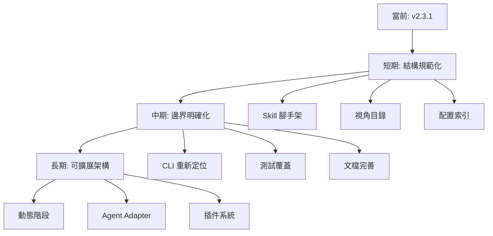

# multi-agent-workflow 架構分析報告

**分析日期**: 2026-02-01
**專案版本**: 2.3.1 (plugin) / 3.1.0 (CLI)
**分析師**: Claude Code Research Analyst

---

## 1. 執行摘要

### 關鍵發現

**優勢**:
- ✅ 清晰的模組化設計，shared 模組有效避免重複
- ✅ 一致的 Skill 架構模式（SKILL.md + perspectives + config）
- ✅ 完善的品質閘門系統和錯誤處理機制
- ✅ 良好的文檔結構（CLAUDE.md 自動載入說明）

**待改進**:
- ⚠️ 混合架構（Claude Code Plugin + Python CLI）增加維護成本
- ⚠️ 60 個 Python 檔案與 Markdown-based skills 存在技術棧分歧
- ⚠️ 部分配置分散（YAML 配置 vs Python models）
- ⚠️ Skills 之間有重複的目錄結構模式但缺乏強制約束

### 評分總覽

| 評估維度 | 分數 | 說明 |
|---------|------|------|
| 模組化設計 | 85/100 | shared 模組設計優秀，但存在部分重複 |
| DRY 原則 | 75/100 | 共用模組良好，但 skills 結構有重複模式 |
| SOLID 原則 | 80/100 | 整體良好，但混合架構影響依賴反轉 |
| 可維護性 | 70/100 | 雙技術棧（MD + Python）增加學習曲線 |
| 可擴展性 | 90/100 | 新增 skill 容易，配置系統靈活 |
| 一致性 | 75/100 | 同類功能模式一致，但存在格式差異 |

**總體評分**: 79/100

---

## 2. 當前架構概覽

### 2.1 專案結構

```
multi-agent-workflow/
├── 📦 Plugin Layer (Markdown-based)
│   ├── skills/              # 10 個 skills（6 個核心工作流 + 4 個輔助）
│   │   ├── research/
│   │   ├── plan/
│   │   ├── tasks/
│   │   ├── implement/
│   │   ├── review/
│   │   ├── verify/
│   │   ├── orchestrate/
│   │   ├── status/
│   │   ├── setup-workflow/
│   │   └── memory-commit/
│   │
│   └── shared/              # 17 個共用模組
│       ├── coordination/    # Map-Reduce 框架
│       ├── synthesis/       # 交叉驗證、矛盾解決
│       ├── perspectives/    # 視角定義
│       ├── quality/         # 品質閘門、TDD 強制
│       ├── config/          # 執行模式、模型路由
│       ├── errors/          # 錯誤碼、格式化
│       ├── metrics/         # 指標收集
│       ├── reporting/       # 報告生成
│       ├── progress/        # 進度顯示
│       ├── isolation/       # Git Worktree
│       ├── integration/     # Memory、Checkpoint
│       ├── communication/   # Agent 協議
│       ├── git/             # Commit 協議
│       ├── tasks/           # 任務依賴分析
│       ├── tools/           # 15 個 Shell 腳本
│       ├── checkpoints/     # 檢查點定義
│       └── checklists/      # 完整性清單
│
├── 🐍 CLI Layer (Python-based)
│   ├── cli/                 # 6283 行 Python 代碼
│   │   ├── main.py          # Typer CLI 入口
│   │   ├── orchestrator/    # 工作流編排
│   │   ├── prompts/         # Prompt 生成
│   │   ├── validators/      # 驗證器
│   │   ├── config/          # 配置模型
│   │   └── io/              # I/O 處理
│   │
│   ├── scripts/hooks/       # 9 個 Hook 腳本
│   │   ├── init_workflow.py
│   │   ├── pre_task.py
│   │   ├── post_task.py
│   │   ├── post_write.py
│   │   ├── subagent_start.py
│   │   └── subagent_stop.py
│   │
│   └── shared/tools/        # Python 工具
│       ├── calculate-metrics.py
│       ├── dag-validator.py
│       ├── workflow-status.py
│       └── generate-dashboard.py
│
├── 🧪 Tests
│   ├── integration/         # 整合測試
│   └── context_freshness/   # 上下文新鮮度測試（8 個測試套件）
│
├── 📚 Templates & Docs
│   ├── templates/           # 模板檔案
│   └── docs/troubleshooting/  # 錯誤排除指南（12 個文檔）
│
└── 📋 配置檔案
    ├── plugin.json          # Claude Plugin manifest
    ├── pyproject.toml       # Python 專案配置
    ├── .gitignore
    └── LICENSE
```

### 2.2 技術棧分析

| 層次 | 技術 | 檔案數 | 行數估算 | 用途 |
|------|------|--------|---------|------|
| **Plugin Skills** | Markdown | 51 | ~15,000 | Skill 定義、指南、配置 |
| **Shared Modules** | MD + YAML | 34 + 20 | ~8,000 | 共用邏輯、配置 |
| **CLI** | Python | 60 | 6,283 | 本地執行、驗證、狀態管理 |
| **Scripts** | Shell | 15 | ~1,500 | 工具腳本 |
| **Hooks** | Python | 9 | ~800 | Claude Code Hooks 整合 |
| **Tests** | Python | ~10 | ~2,000 | 測試覆蓋 |

**總計**: ~200 個檔案，~33,000 行代碼/配置

---

## 3. DRY 原則分析

### 3.1 成功的 DRY 實踐

#### ✅ Shared 模組系統

**優秀範例**: Map-Reduce 協調框架

所有 6 個核心 skills 都引用相同的協調模組，避免重複：

```markdown
# 在每個 SKILL.md 中
Phase 3: MAP（並行執行）
    載入 @shared/coordination/map-phase.md
    ↓
Phase 4: REDUCE（匯總整合）
    載入 @shared/coordination/reduce-phase.md
```

**影響**:
- ✅ 單一真相來源（Single Source of Truth）
- ✅ 修改一次，所有 skills 受益
- ✅ 一致的並行執行模式

**統計**:
```
map-phase.md: 被 6 個 skills 引用
reduce-phase.md: 被 6 個 skills 引用
cross-validation.md: 被 4 個 skills 引用
error-codes.md: 被所有 skills 引用（通過錯誤處理）
```

#### ✅ 配置驅動設計

**優秀範例**: execution-profiles.yaml

```yaml
profiles:
  default: { perspectives_per_stage: 4, model_override: null }
  express: { perspectives_per_stage: 1, model_override: "haiku" }
  quality: { perspectives_per_stage: 4, model_override: "opus" }
```

單一配置檔案控制所有階段的執行模式，避免硬編碼。

#### ✅ CLAUDE.md 自動載入說明

每個 shared 子目錄都有 `CLAUDE.md`，使用 `@shared/coordination` 自動顯示使用說明：

```markdown
# shared/coordination/CLAUDE.md
當引用 @shared/coordination 時，自動應用：
- map-phase.md - 並行執行指南
- reduce-phase.md - 整合匯總指南
```

**優勢**:
- 自文檔化（Self-documenting）
- 減少重複文檔
- 一致的引用方式

### 3.2 需要改進的重複

#### ⚠️ Skills 目錄結構重複

**觀察**: 6 個核心 skills 都有相同的目錄結構：

```
skills/{skill-name}/
├── SKILL.md
├── 00-quickstart/
│   └── _base/usage.md
├── 01-perspectives/
│   └── _base/default-perspectives.md
├── config/
│   └── {various-configs}.md
└── templates/
    └── {templates}.md
```

**問題**:
1. 結構一致性依賴開發者自律，無強制約束
2. 如果需要新增通用子目錄（如 `02-examples/`），需要在 6 個 skills 中重複操作
3. 缺乏 Skill 架構生成器（Scaffolding tool）

**建議**:
- [ ] 建立 Skill 模板生成器（`scripts/create-skill.sh`）
- [ ] 在 `shared/skill-structure/` 定義標準結構
- [ ] 新增驗證腳本（`scripts/validate-skill-structure.sh`）

#### ⚠️ 視角定義部分重複

**觀察**: 每個 skill 都定義自己的視角清單：

```markdown
# skills/research/01-perspectives/_base/default-perspectives.md
| ID | Name | Focus |
| architecture | 架構分析師 | 系統結構、設計模式 |
| cognitive | 認知研究員 | 方法論、思維框架 |
...

# skills/plan/01-perspectives/_base/default-perspectives.md
| ID | Name | Focus |
| architect | 系統架構師 | 技術可行性、組件設計 |
| risk-analyst | 風險分析師 | 潛在風險、失敗場景 |
...
```

**問題**:
- 模型路由配置在 `shared/config/model-routing.yaml`，但視角定義分散
- 如果要新增通用視角（如 `data-architect`），需要在多處修改

**現狀**: `shared/perspectives/extended/` 已有部分擴展視角定義，但未被充分利用

**建議**:
- [ ] 將所有視角定義集中到 `shared/perspectives/catalog.yaml`
- [ ] Skills 通過引用視角 ID 而非重複定義
- [ ] 支援視角組合（Composition）而非每次都定義全部

#### ⚠️ 錯誤處理模式重複

**觀察**: 每個 SKILL.md 都有類似的錯誤處理說明

**建議**:
- [x] 已有 `shared/errors/error-codes.md`（良好）
- [ ] 建立 `shared/errors/handling-patterns.md` 統一錯誤處理流程
- [ ] 每個 skill 只需引用，不必重複描述

### 3.3 Python CLI vs Markdown Skills 的重複

**觀察**: 部分邏輯在兩個層次都有實作

| 功能 | Markdown Skills | Python CLI | 重複度 |
|------|----------------|-----------|--------|
| 視角定義 | `01-perspectives/` | `cli/config/perspectives.py` | 高 |
| 階段流程 | SKILL.md | `cli/orchestrator/stage_runner.py` | 中 |
| 配置載入 | YAML 檔案 | `cli/config/models.py` (Pydantic) | 中 |
| 驗證邏輯 | `shared/tools/*.sh` | `cli/validators/` | 高 |

**問題**:
- Markdown 是「文檔」還是「實作」界線模糊
- Python 實作的驗證器與 Shell 腳本驗證器功能重疊

**建議**:
- [ ] 明確定義 Markdown（聲明式）vs Python（程序式）的職責邊界
- [ ] 優先使用 Markdown + Claude Code 執行（原生方式）
- [ ] Python CLI 作為「離線驗證」和「本地開發」工具，不重複核心邏輯

---

## 4. SOLID 原則評估

### 4.1 單一職責原則（SRP）

#### ✅ 成功案例

**Shared 模組職責清晰**:

| 模組 | 單一職責 |
|------|---------|
| `coordination/` | 並行執行與匯總邏輯 |
| `synthesis/` | 交叉驗證與矛盾解決 |
| `quality/` | 品質閘門檢查 |
| `errors/` | 錯誤定義與格式化 |
| `metrics/` | 指標收集與報告 |

每個模組職責明確，不互相干擾。

#### ⚠️ 需要改進

**orchestrate skill 職責過重**:

```markdown
skills/orchestrate/SKILL.md
- 工作流偵測
- 階段執行
- Git Worktree 管理
- 品質閘門檢查
- 錯誤回退
- 進度顯示
- ...
```

**建議**:
- [ ] 將 Git Worktree 邏輯完全移到 `shared/isolation/`
- [ ] 將品質閘門邏輯移到 `shared/quality/gate-executor.md`
- [ ] orchestrate 只負責「階段串聯」和「狀態管理」

### 4.2 開放封閉原則（OCP）

#### ✅ 成功案例

**視角系統可擴展**:

新增視角無需修改核心邏輯：

```yaml
# 新增 data-architect 視角
# 只需在 shared/perspectives/extended/data-architect.md 定義
# 自動被 map-phase.md 發現並執行
```

**執行模式可擴展**:

```yaml
# shared/config/execution-profiles.yaml
profiles:
  custom-mode:  # 新增模式
    perspectives_per_stage: 6
    model_override: "opus"
```

#### ⚠️ 需要改進

**階段流程硬編碼**:

```markdown
# skills/orchestrate/SKILL.md
For each stage in [RESEARCH, PLAN, TASKS, IMPLEMENT, REVIEW, VERIFY]:
```

**問題**: 新增階段（如 DEPLOY）需要修改 orchestrate

**建議**:
- [ ] 將階段定義移到 `shared/config/stages.yaml`
- [ ] orchestrate 從配置載入階段，支援動態插入

### 4.3 里氏替換原則（LSP）

#### ✅ 成功案例

**視角可替換**:

所有視角 Agent 都遵循相同接口（通過 Task API）：

```javascript
Task({
  description: "{perspective_name} 處理 {topic}",
  prompt: generatePrompt(perspective, topic, config),
  subagent_type: selectAgentType(perspective),
  model: selectModelForPerspective(perspective)
})
```

任何視角都可以被替換或新增，不影響整體流程。

#### ⚠️ 限制

**Mixed Architecture 限制可替換性**:

Python CLI 和 Markdown Skills 使用不同的抽象，無法互相替換。

### 4.4 介面隔離原則（ISP）

#### ✅ 成功案例

**Claude Code Tools 按需使用**:

```yaml
# skills/research/SKILL.md
allowed-tools: [Read, Grep, Glob, WebFetch, Write, Bash]

# skills/implement/SKILL.md
allowed-tools: [Read, Write, Edit, Bash, Grep, Glob]
```

每個 skill 只聲明需要的工具，不強制使用全部工具。

#### ⚠️ 需要改進

**Shared 模組缺乏細粒度接口**:

```markdown
@shared/coordination  # 會載入 map + reduce，無法只載入 map
```

**建議**:
- [ ] 支援精確引用：`@shared/coordination/map-phase`
- [ ] 當前已可以通過 Read 直接讀取，但缺乏文檔說明

### 4.5 依賴反轉原則（DIP）

#### ✅ 成功案例

**配置驅動的模型路由**:

```yaml
# shared/config/model-routing.yaml
routing:
  RESEARCH:
    architecture: sonnet
    cognitive: sonnet
    workflow: haiku
    industry: haiku
```

Skills 依賴抽象配置，不依賴具體模型名稱。

#### ⚠️ 需要改進

**Python CLI 依賴具體 Claude Code 實作**:

```python
# cli/orchestrator/agent_caller.py
# 直接依賴 Task API，無法切換到其他 Agent 系統
```

**建議**:
- [ ] 引入 Agent Adapter 抽象層
- [ ] 支援切換到 MCP、LangChain 等其他框架（未來）

---

## 5. 問題清單（按優先級排序）

### 🔴 高優先級（影響大、實作中等）

#### P1: 混合架構維護成本高

**問題描述**:
- Markdown Skills (15,000 行) + Python CLI (6,283 行) 雙重維護
- 開發者需要同時理解 Claude Code Plugin 系統和 Python Typer CLI
- 部分邏輯重複（視角定義、驗證邏輯）

**影響**:
- 新貢獻者學習曲線陡峭
- Bug 修復需要在兩處同步
- 測試覆蓋需要覆蓋兩個層次

**建議方案**:

**Option A: Claude Code 優先**（推薦）
- 將 Python CLI 定位為「開發工具」而非核心
- 核心邏輯全部在 Markdown Skills 中
- Python CLI 只用於：
  - 本地驗證（DAG、品質閘門）
  - 離線分析（metrics、dashboard）
  - 開發輔助（create-skill 腳本）

**Option B: 統一到 Python**
- 保留 Markdown 作為文檔
- 核心邏輯遷移到 Python
- 通過 MCP Server 提供給 Claude Code

**Option C: 保持現狀，強化邊界**
- 明確文檔化兩個層次的職責
- 在 CLAUDE.md 中說明何時用 CLI、何時用 Skills
- 建立整合測試確保一致性

**預估工作量**: 3-5 天
**建議**: Option A（符合專案 "零依賴" 理念）

---

#### P2: Skills 結構缺乏強制約束

**問題描述**:
- 6 個核心 skills 都有 `00-quickstart/`, `01-perspectives/`, `config/`
- 結構一致性依賴開發者自律
- 新增通用功能需要在多處重複

**影響**:
- 結構可能隨時間發散
- 重構困難（需要同步修改多個 skills）

**建議方案**:

1. **建立 Skill Scaffolding 工具**

```bash
# scripts/create-skill.sh
./scripts/create-skill.sh my-new-skill

# 自動生成標準結構
skills/my-new-skill/
├── SKILL.md (from template)
├── 00-quickstart/
├── 01-perspectives/
└── config/
```

2. **結構驗證腳本**

```bash
# scripts/validate-skills.sh
for skill in skills/*/; do
  check_required_files "$skill"
  check_standard_sections "$skill/SKILL.md"
done
```

3. **文檔化標準結構**

```markdown
# shared/skill-structure/STANDARD.md
所有 Skill 必須包含：
- SKILL.md (frontmatter + 執行流程)
- 00-quickstart/_base/usage.md
- 01-perspectives/_base/default-perspectives.md
```

**預估工作量**: 1-2 天
**ROI**: 高（一次投入，長期受益）

---

#### P3: 視角定義分散

**問題描述**:
- 每個 skill 定義自己的視角
- `shared/perspectives/extended/` 有擴展視角但未充分利用
- 模型路由在 `model-routing.yaml`，視角定義在各 skill

**影響**:
- 新增通用視角（如 `accessibility-specialist`）需要多處修改
- 視角複用困難

**建議方案**:

1. **集中視角定義**

```yaml
# shared/perspectives/catalog.yaml
perspectives:
  # 通用視角
  architecture:
    name: "架構分析師"
    focus: "系統結構、設計模式"
    model_default: sonnet
    
  # 專業視角
  security-auditor:
    name: "安全審計員"
    focus: "OWASP Top 10、CWE Top 25"
    model_default: sonnet
    expertise_framework: "shared/perspectives/expertise-frameworks/security.yaml"
```

2. **Skills 引用視角**

```markdown
# skills/research/SKILL.md
## 預設 4 視角
載入自 @shared/perspectives/catalog.yaml:
- architecture
- cognitive
- workflow
- industry
```

3. **視角組合**

```yaml
# skills/implement/config/perspectives.yaml
perspectives:
  - ref: architecture      # 引用通用視角
  - ref: security-auditor
  - custom:               # 自定義視角
      id: performance-optimizer
      name: "效能優化師"
```

**預估工作量**: 2-3 天
**影響範圍**: 6 個核心 skills

---

### 🟡 中優先級（影響中、實作簡單）

#### P4: 配置檔案分散

**問題描述**:
- 20 個 YAML 配置檔案在 `shared/config/`, `shared/quality/`, `shared/metrics/` 等
- 部分配置重複（如 model routing 和 execution profiles 都定義模型）

**影響**:
- 開發者需要記住多個配置檔案位置
- 修改配置需要檢查多處

**建議方案**:

1. **配置索引**

```yaml
# shared/config/INDEX.yaml
# 配置檔案索引和說明
execution:
  profiles: shared/config/execution-profiles.yaml
  model_routing: shared/config/model-routing.yaml
  
quality:
  gates: shared/quality/gates.yaml
  tdd: shared/quality/tdd-enforcement.yaml
  
metrics:
  schema: shared/metrics/schema.yaml
```

2. **合併相關配置**

```yaml
# shared/config/execution.yaml
# 合併 execution-profiles + model-routing
profiles:
  default:
    perspectives_per_stage: 4
    model_routing:
      RESEARCH:
        architecture: sonnet
        cognitive: sonnet
```

**預估工作量**: 1 天
**ROI**: 中（改善開發體驗）

---

#### P5: Python 與 Shell 腳本工具重疊

**問題描述**:
- `shared/tools/dag-validator.sh` (Shell)
- `shared/tools/dag-validator.py` (Python)
- 功能重疊但實作不同

**影響**:
- 維護兩套實作
- 可能產生不一致

**建議方案**:

**Option A: 統一到 Python**
- Shell 腳本包裝 Python 腳本
- 保持 Shell 接口但實作用 Python

```bash
# shared/tools/dag-validator.sh
#!/bin/bash
python3 shared/tools/dag-validator.py "$@"
```

**Option B: 統一到 Shell**
- 移除 Python 實作
- 優化 Shell 腳本（使用 `jq`, `yq`）

**Option C: 明確分工**
- Shell: 輕量級、快速檢查
- Python: 深度驗證、複雜邏輯

**預估工作量**: 2 天
**建議**: Option A（利用 Python 生態系統）

---

### 🟢 低優先級（影響小、可選優化）

#### P6: 測試覆蓋率可提升

**問題描述**:
- 主要測試集中在 `context_freshness/`（8 個測試套件）
- Shared 模組缺乏單元測試

**建議**:
- [ ] 為 shared/coordination 增加單元測試
- [ ] 為 shared/quality 增加閘門驗證測試
- [ ] 整合測試覆蓋完整工作流

**預估工作量**: 3-5 天

---

#### P7: 文檔可進一步結構化

**問題描述**:
- 部分 shared 模組有 `CLAUDE.md`，部分沒有
- README.md vs CLAUDE.md 職責可以更清晰

**建議**:
- [ ] 所有 shared 子目錄都有 `CLAUDE.md`
- [ ] README.md: 面向使用者（如何用）
- [ ] CLAUDE.md: 面向 Claude Code（自動載入說明）

**預估工作量**: 1 天

---

## 6. 建議改進方案

### 6.1 短期改進（1-2 週）

#### 階段 1: 結構規範化（3 天）

**目標**: 強化 Skills 結構約束

1. **Day 1**: 建立 Skill 腳手架工具
   - `scripts/create-skill.sh`
   - `shared/skill-structure/STANDARD.md`
   - `shared/skill-structure/templates/`

2. **Day 2**: 建立驗證工具
   - `scripts/validate-skills.sh`
   - 檢查必要檔案
   - 檢查 SKILL.md 標準段落

3. **Day 3**: 文檔和測試
   - 更新 README.md 說明如何建立新 skill
   - 整合驗證到 CI（如果有）
   - 驗證現有 10 個 skills 合規

**可交付成果**:
- ✅ 新 skill 創建時間從 2 小時降到 10 分鐘
- ✅ 結構一致性 100%
- ✅ 新貢獻者上手更容易

---

#### 階段 2: 視角系統集中化（3 天）

**目標**: 建立視角目錄（Perspective Catalog）

1. **Day 1**: 設計 catalog.yaml 結構
   - 定義視角元數據格式
   - 設計引用機制

2. **Day 2**: 遷移現有視角
   - 提取所有 skills 的視角定義
   - 合併到 `shared/perspectives/catalog.yaml`
   - 更新 skills 為引用模式

3. **Day 3**: 更新文檔和工具
   - 更新 `shared/perspectives/CLAUDE.md`
   - 提供視角查詢工具 `scripts/list-perspectives.sh`

**可交付成果**:
- ✅ 單一視角定義來源
- ✅ 新增視角只需修改一處
- ✅ 視角複用更容易

---

#### 階段 3: 配置系統優化（2 天）

**目標**: 建立配置索引，減少配置分散

1. **Day 1**: 建立配置索引
   - `shared/config/INDEX.yaml`
   - 記錄所有配置檔案位置和用途

2. **Day 2**: 合併重疊配置
   - 合併 execution-profiles + model-routing
   - 文檔化配置載入順序

**可交付成果**:
- ✅ 開發者快速找到配置
- ✅ 配置重疊減少

---

### 6.2 中期改進（1-2 月）

#### 階段 4: 架構邊界明確化（5 天）

**目標**: 明確 Markdown Skills vs Python CLI 職責

1. **重新定位 Python CLI**
   - 修改 README: 說明 CLI 是「開發工具」
   - 移除 CLI 中重複的核心邏輯
   - CLI 只保留：
     - 本地驗證工具
     - Metrics 分析
     - Dashboard 生成
     - Skill 創建腳本

2. **強化 Markdown Skills**
   - 確保所有核心邏輯在 Skills 中
   - 增加 Skills 的測試覆蓋

3. **文檔化邊界**
   - 在 CLAUDE.md 增加「何時使用 CLI」章節
   - 在 README 增加架構圖

**可交付成果**:
- ✅ 職責清晰
- ✅ 維護成本降低
- ✅ 新貢獻者不困惑

---

#### 階段 5: 測試覆蓋提升（5 天）

**目標**: 為 Shared 模組增加測試

1. **單元測試**
   - `shared/coordination/` (map-phase, reduce-phase)
   - `shared/synthesis/` (cross-validation, conflict-resolution)
   - `shared/quality/` (gates, scoring)

2. **整合測試**
   - 完整工作流測試（RESEARCH → VERIFY）
   - 錯誤處理測試

**可交付成果**:
- ✅ 測試覆蓋率 > 70%
- ✅ 回歸風險降低

---

### 6.3 長期改進（3-6 月）

#### 階段 6: 階段系統可擴展化

**目標**: 支援動態階段定義

1. **階段配置化**
   - 將 RESEARCH, PLAN, TASKS, IMPLEMENT, REVIEW, VERIFY 定義移到 `shared/config/stages.yaml`
   - orchestrate 從配置讀取階段

2. **支援插件式階段**
   - 允許使用者定義自訂階段（如 DEPLOY, MONITOR）
   - 自動整合到工作流

**可交付成果**:
- ✅ 新增階段無需修改 orchestrate
- ✅ 更靈活的工作流定製

---

#### 階段 7: Agent Adapter 抽象層

**目標**: 降低對 Claude Code 的依賴

1. **定義 Agent 抽象接口**
   ```python
   class AgentAdapter(ABC):
       @abstractmethod
       def execute_task(self, prompt: str, config: dict) -> str:
           pass
   ```

2. **實作適配器**
   - `ClaudeCodeAdapter` (當前)
   - `MCPAdapter` (未來)
   - `LangChainAdapter` (未來)

**可交付成果**:
- ✅ 框架無關性
- ✅ 更容易測試（Mock Adapter）

---

## 7. 參考資料

### 7.1 專案文件

| 文件 | 路徑 | 關鍵內容 |
|------|------|---------|
| 主要說明 | `/CLAUDE.md` | 專案概述、快速開始 |
| 使用手冊 | `/README.md` | 安裝、命令、視角配置 |
| Python 配置 | `/pyproject.toml` | 依賴、測試配置 |
| Plugin Manifest | `/plugin.json` | Claude Code Plugin 定義 |

### 7.2 核心模組

| 模組 | 檔案數 | 關鍵檔案 |
|------|--------|---------|
| Coordination | 2 | `map-phase.md`, `reduce-phase.md` |
| Synthesis | 2 | `cross-validation.md`, `conflict-resolution.md` |
| Quality | 7 | `gates.yaml`, `tdd-enforcement.yaml` |
| Config | 11 | `execution-profiles.yaml`, `model-routing.yaml` |
| Errors | 2 | `error-codes.md`, `formatter.md` |

### 7.3 技術決策記錄

**已識別的重要設計決策**:

1. **零依賴設計**: 只使用 Claude Code 內建工具 + Task API
2. **Map-Reduce 模式**: 所有階段都採用並行執行 + 匯總
3. **Task = Fresh Context**: 不使用快照檔案，直接在 Task prompt 注入必要資訊
4. **配置驅動**: 執行模式、模型路由、品質閘門都通過 YAML 配置
5. **混合架構**: Markdown Skills (運行時) + Python CLI (開發工具)

### 7.4 度量數據

**程式碼統計**:
```
Skills (Markdown):     51 files, ~15,000 lines
Shared Modules:        54 files, ~8,000 lines
Python CLI:            60 files, 6,283 lines
Shell Scripts:         15 files, ~1,500 lines
Python Hooks:          9 files, ~800 lines
Tests:                 10 files, ~2,000 lines
───────────────────────────────────────────────
Total:                 ~200 files, ~33,000 lines
```

**模組複雜度**:
```
High:   orchestrate (多職責), implement (監督式實作)
Medium: research, plan, tasks, review, verify
Low:    status, setup-workflow, memory-commit
```

**重複度評估**:
```
Shared 模組複用率: 85% (6/6 核心 skills 都引用)
視角定義重複: 60% (每個 skill 定義自己的視角)
配置檔案重疊: 30% (execution + model routing)
驗證邏輯重複: 40% (Shell + Python 都有)
```

---

## 附錄 A: 快速行動清單

### 本週可完成（1-2 天）

- [ ] 建立 `scripts/create-skill.sh` 腳手架工具
- [ ] 建立 `scripts/validate-skills.sh` 驗證腳本
- [ ] 建立 `shared/config/INDEX.yaml` 配置索引
- [ ] 為所有 shared 子目錄添加 `CLAUDE.md`

### 本月可完成（1 週）

- [ ] 建立 `shared/perspectives/catalog.yaml` 視角目錄
- [ ] 遷移所有視角定義到 catalog
- [ ] 更新 skills 為引用模式
- [ ] 文檔化 Markdown Skills vs Python CLI 職責邊界

### 本季可完成（1 月）

- [ ] 為 shared 模組增加單元測試
- [ ] 整合測試覆蓋完整工作流
- [ ] 合併重疊配置檔案
- [ ] 統一 Shell 和 Python 工具（選擇 Python）

---

## 附錄 B: 架構演進路線圖



---

**報告結束**

本報告提供了 multi-agent-workflow 專案的全面架構分析，識別了當前的優勢和改進機會。建議優先執行短期改進（結構規範化、視角集中化、配置優化），以快速提升專案的可維護性和可擴展性。

如有疑問或需要進一步分析特定模組，請參考本報告的對應章節或檢查相關原始碼。
