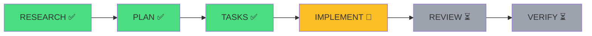
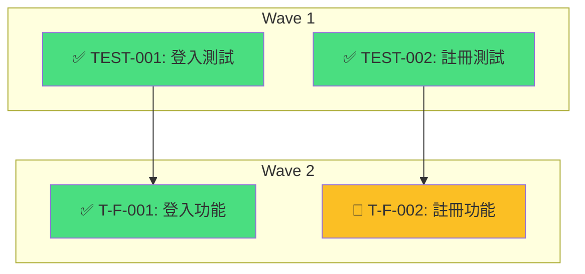

# 進度顯示模組

> 提供即時工作流執行進度可視化

## 概述

進度顯示模組在工作流執行期間提供即時狀態更新，讓使用者清楚了解當前執行進度。

## 進度元素

### 1. 階段進度條

顯示整體工作流進度：

```
┌─────────────────────────────────────────────────────────────┐
│  Multi-Agent Workflow Progress                               │
├─────────────────────────────────────────────────────────────┤
│                                                              │
│  RESEARCH → PLAN → IMPLEMENT → REVIEW → VERIFY              │
│     ✅       ✅       🔄        ⏳       ⏳                  │
│                                                              │
│  [████████████████████░░░░░░░░░░] 60%                       │
│                                                              │
│  當前：IMPLEMENT (3/5 任務)                                  │
│  已耗時：15 分鐘                                             │
└─────────────────────────────────────────────────────────────┘
```

### 2. 視角狀態顯示

顯示各視角的執行狀態：

```
┌─────────────────────────────────────────────────────────────┐
│  Phase: IMPLEMENT - 視角監督                                 │
├─────────────────────────────────────────────────────────────┤
│                                                              │
│  ┌─────────────┬─────────────┬─────────────┬─────────────┐ │
│  │ TDD 守護者  │ 效能優化師  │ 安全審計員  │ 維護性專家  │ │
│  │     ✅      │     🔄      │     ⏳      │     ⏳      │ │
│  │   2.5 分鐘  │   執行中... │    等待中   │    等待中   │ │
│  └─────────────┴─────────────┴─────────────┴─────────────┘ │
│                                                              │
│  已完成：1/4 視角                                            │
└─────────────────────────────────────────────────────────────┘
```

### 3. 階段轉換通知

階段切換時顯示通知：

```
┌─────────────────────────────────────────────────────────────┐
│  ✅ PLAN 階段完成                                            │
│                                                              │
│  摘要：                                                      │
│  - 4 個視角完成                                              │
│  - 耗時：8 分鐘                                              │
│  - 產出：implementation-plan.md                              │
│                                                              │
│  ➡️ 進入 IMPLEMENT 階段...                                   │
└─────────────────────────────────────────────────────────────┘
```

### 4. 時間追蹤

顯示已耗時和預估剩餘：

```
┌─────────────────────────────────────────────────────────────┐
│  時間追蹤                                                    │
├─────────────────────────────────────────────────────────────┤
│                                                              │
│  已耗時：25 分鐘                                             │
│  預估剩餘：~15 分鐘                                          │
│  預估總時間：~40 分鐘                                        │
│                                                              │
│  階段耗時：                                                  │
│  - RESEARCH：8 分鐘 ✅                                       │
│  - PLAN：7 分鐘 ✅                                           │
│  - IMPLEMENT：10 分鐘 🔄 (進行中)                            │
│  - REVIEW：~5 分鐘 (預估)                                    │
│  - VERIFY：~5 分鐘 (預估)                                    │
└─────────────────────────────────────────────────────────────┘
```

## 狀態圖示

### 階段狀態

| 圖示 | 狀態 | 說明 |
|------|------|------|
| ⏳ | pending | 等待執行 |
| 🔄 | running | 執行中 |
| ✅ | completed | 成功完成 |
| ❌ | failed | 執行失敗 |
| ⏭️ | skipped | 已跳過 |
| 🔙 | rollback | 回退中 |

### 視角狀態

| 圖示 | 狀態 | 說明 |
|------|------|------|
| ⏳ | pending | 等待啟動 |
| 🔄 | running | 執行中 |
| ✅ | completed | 完成（無問題） |
| ⚠️ | completed_with_warnings | 完成（有警告） |
| ❌ | failed | 執行失敗 |

## 進度更新時機

### 觸發事件

```yaml
progress_events:
  # 工作流級別
  - workflow_start
  - workflow_end

  # 階段級別
  - stage_start
  - stage_progress      # 階段內進度更新
  - stage_end

  # 視角級別
  - perspective_start
  - perspective_end

  # 任務級別（IMPLEMENT）
  - task_start
  - task_end

  # 迭代級別
  - iteration_start
  - iteration_end
  - rollback_triggered
```

### 更新頻率

```yaml
update_frequency:
  stage_progress: "10 seconds"    # 階段進度每 10 秒更新
  perspective_status: "on_change"  # 視角狀態變化時立即更新
  time_tracking: "30 seconds"      # 時間追蹤每 30 秒更新
```

## 進度顯示格式

### 簡潔模式

適用於終端寬度有限的情況：

```
[IMPLEMENT] 🔄 60% | 15 分鐘 | 視角: ✅✅🔄⏳
```

### 詳細模式

預設模式，顯示完整資訊：

```
┌──────────────────────────────────────────────────────────────────┐
│  Multi-Agent Workflow: 用戶認證功能                               │
├──────────────────────────────────────────────────────────────────┤
│                                                                   │
│  進度：[████████████████████░░░░░░░░░░] 60%                      │
│                                                                   │
│  RESEARCH ─── PLAN ─── IMPLEMENT ─── REVIEW ─── VERIFY           │
│      ✅         ✅         🔄          ⏳         ⏳              │
│                                                                   │
│  當前階段：IMPLEMENT                                              │
│  - 任務進度：3/5 完成                                            │
│  - 視角狀態：✅ TDD | 🔄 效能 | ⏳ 安全 | ⏳ 維護                │
│                                                                   │
│  時間：15 分鐘 已用 | ~15 分鐘 剩餘                               │
│                                                                   │
└──────────────────────────────────────────────────────────────────┘
```

### JSON 模式

適用於程式化處理：

```json
{
  "workflow_id": "abc123",
  "task": "用戶認證功能",
  "progress_percent": 60,
  "current_stage": "implement",
  "stages": {
    "research": { "status": "completed", "duration_sec": 480 },
    "plan": { "status": "completed", "duration_sec": 420 },
    "implement": { "status": "running", "progress": "3/5" },
    "review": { "status": "pending" },
    "verify": { "status": "pending" }
  },
  "perspectives": [
    { "id": "tdd", "status": "completed" },
    { "id": "performance", "status": "running" },
    { "id": "security", "status": "pending" },
    { "id": "maintainer", "status": "pending" }
  ],
  "elapsed_sec": 900,
  "estimated_remaining_sec": 900
}
```

## 進度計算

### 整體進度

```yaml
progress_calculation:
  # 各階段權重
  stage_weights:
    research: 0.15
    plan: 0.15
    implement: 0.40
    review: 0.15
    verify: 0.15

  # 計算公式
  # progress = sum(stage_weight * stage_progress)

  # 階段內進度
  stage_progress:
    research: "perspectives_completed / total_perspectives"
    plan: "perspectives_completed / total_perspectives"
    implement: "tasks_completed / total_tasks"
    review: "perspectives_completed / total_perspectives"
    verify: "perspectives_completed / total_perspectives"
```

### 時間預估

```yaml
time_estimation:
  method: "historical_average"

  # 使用基準線數據
  baseline:
    stage_duration_percent:
      research: 0.15
      plan: 0.20
      implement: 0.35
      review: 0.15
      verify: 0.15

  # 動態調整
  # 根據已完成階段的實際耗時調整預估

  # 預估公式
  # remaining = (elapsed / completed_percent) * remaining_percent
```

## 回退進度處理

### 回退顯示

```
┌─────────────────────────────────────────────────────────────┐
│  🔙 回退通知                                                 │
├─────────────────────────────────────────────────────────────┤
│                                                              │
│  REVIEW 發現 BLOCKER，回退到 IMPLEMENT                       │
│                                                              │
│  原因：安全漏洞 - SQL 注入風險                               │
│  迭代：第 2 次（共 3 次上限）                                │
│                                                              │
│  進度重置：                                                  │
│  - IMPLEMENT：重新執行                                       │
│  - REVIEW：重新執行                                          │
│  - VERIFY：重新執行                                          │
│                                                              │
└─────────────────────────────────────────────────────────────┘
```

### 進度重算

```yaml
rollback_progress:
  # 回退時保留已完成階段的進度
  # 重置回退點之後的階段

  example:
    before_rollback:
      research: 100%
      plan: 100%
      implement: 100%
      review: 50%
      verify: 0%
      total: 70%

    after_rollback:
      research: 100%
      plan: 100%
      implement: 0%    # 重置
      review: 0%       # 重置
      verify: 0%       # 重置
      total: 30%       # 重新計算
```

## 整合到 SKILL.md

### 在 orchestrate/SKILL.md 中使用

```markdown
## 執行流程

工作流開始時顯示初始進度：

<!-- PROGRESS: workflow_start -->

每個階段開始時更新進度：

<!-- PROGRESS: stage_start stage_id={stage} -->

每個階段結束時更新進度：

<!-- PROGRESS: stage_end stage_id={stage} -->
```

## Mermaid 圖表格式

### 階段流程圖

用於展示工作流階段進度：



**節點 ID 規範**：
- RESEARCH → RES
- PLAN → PLN
- TASKS → TSK
- IMPLEMENT → IMP
- REVIEW → REV
- VERIFY → VER

### 任務 DAG 圖

用於展示任務依賴關係：



**任務 ID 規範**：
- 使用底線取代連字號（`TEST_001` 而非 `TEST-001`）
- 在標籤中顯示原始 ID

### 顏色規範

| 狀態 | 顏色 | Hex |
|------|------|-----|
| completed | 綠色 | `#4ade80` |
| running / in_progress | 琥珀色 | `#fbbf24` |
| pending | 灰色 | `#9ca3af` |
| failed | 紅色 | `#f87171` |
| skipped | 藍色 | `#60a5fa` |

## CLI 工具

### workflow-status.py

查看工作流狀態的命令列工具：

```bash
# 顯示當前工作流狀態
python shared/tools/workflow-status.py

# 顯示特定工作流
python shared/tools/workflow-status.py --id user-auth

# 列出所有工作流
python shared/tools/workflow-status.py --list

# 顯示任務 DAG（Mermaid）
python shared/tools/workflow-status.py --dag

# 輸出格式
python shared/tools/workflow-status.py --json        # JSON
python shared/tools/workflow-status.py --markdown   # Markdown + Mermaid
python shared/tools/workflow-status.py --html       # HTML Dashboard

# 輸出到檔案
python shared/tools/workflow-status.py -o dashboard.md
python shared/tools/workflow-status.py --html -o dashboard.html
```

### dag-validator.py

DAG 驗證與可視化工具：

```bash
# 驗證 DAG
python shared/tools/dag-validator.py tasks.yaml

# 生成 Mermaid 圖表
python shared/tools/dag-validator.py tasks.yaml --mermaid

# 輸出到檔案
python shared/tools/dag-validator.py tasks.yaml --mermaid -o dag.md
```

## 相關模組

- [指標收集器](../metrics/collector.md)
- [錯誤格式化](../errors/formatter.md)
- [orchestrate SKILL](../../skills/orchestrate/SKILL.md)
- [status SKILL](../../skills/status/SKILL.md)
- [workflow-status.py](../tools/workflow-status.py)
- [dag-validator.py](../tools/dag-validator.py)
