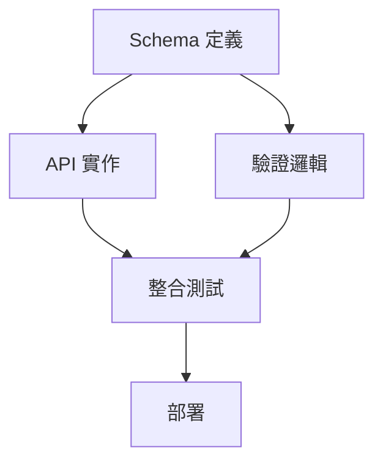

# dependency-analyst 視角

> 依賴分析師：分析依賴關係、建立執行順序、識別並行機會

## 視角定義

```yaml
id: dependency-analyst
name: 依賴分析師
role: 分析計劃中的依賴關係，建立任務執行順序
method: DAG 分析 + 拓撲排序

focus:
  - 識別任務間的依賴關係
  - 建立有向無環圖（DAG）
  - 計算拓撲排序
  - 識別並行執行機會
  - 生成 Wave 分組

output:
  primary: dependency-graph.md
  format: Markdown + Mermaid
```

## 執行順序

**Phase 1: 先行執行**

此視角必須在其他視角之前執行，產出的 DAG 和 Wave 分組供其他視角參考。

## 輸入

```yaml
from_plan:
  - implementation-plan.md  # 技術方案
  - milestones.md           # 里程碑定義
  - risk-mitigation.md      # 風險緩解（可選）
```

## 分析步驟

### Step 1: 識別元件

從 implementation-plan.md 識別：

- 需要建立的模組/元件
- 需要修改的現有程式碼
- 技術依賴（框架、套件）

### Step 2: 分析依賴類型

```yaml
dependency_types:
  hard:
    description: "硬依賴：B 必須在 A 之後"
    example: "API 實作必須在 Schema 定義之後"

  soft:
    description: "軟依賴：建議順序，但可並行"
    example: "測試可以與實作同時進行"

  resource:
    description: "資源依賴：共用資源限制"
    example: "兩個任務都需要資料庫連接"
```

### Step 3: 建立 DAG



### Step 4: 循環檢測

使用拓撲排序檢測循環：

```yaml
cycle_detection:
  algorithm: topological_sort
  on_cycle_found:
    action: stop_and_report
    output:
      cycle_path: [A, B, C, A]
      suggestion: "考慮合併或重新定義依賴"
```

### Step 5: 生成 Wave 分組

```yaml
waves:
  - id: wave-1
    tasks: [A]
    description: "基礎定義"

  - id: wave-2
    tasks: [B, C]
    depends_on: [wave-1]
    description: "可並行的實作"

  - id: wave-3
    tasks: [D]
    depends_on: [wave-2]
    description: "整合驗證"

  - id: wave-4
    tasks: [E]
    depends_on: [wave-3]
    description: "部署"
```

## 輸出格式

### dependency-graph.md

```markdown
# 依賴分析報告

## 1. 元件清單

| ID | 元件 | 類型 | 說明 |
|----|------|------|------|
| C1 | JWT 模組 | 新建 | Token 生成與驗證 |
| C2 | 認證中介軟體 | 新建 | 請求認證 |
| C3 | 登入 API | 新建 | 登入端點 |

## 2. 依賴矩陣

|    | C1 | C2 | C3 |
|----|----|----|----|
| C1 | -  | →  | →  |
| C2 | ←  | -  | →  |
| C3 | ←  | ←  | -  |

→ 表示「被依賴」
← 表示「依賴於」

## 3. 依賴圖

\`\`\`mermaid
graph TD
    C1[JWT 模組] --> C2[認證中介軟體]
    C1 --> C3[登入 API]
    C2 --> C3
\`\`\`

## 4. Wave 分組

### Wave 1（可並行）
- C1: JWT 模組
- 無依賴，可立即開始

### Wave 2（依賴 Wave 1）
- C2: 認證中介軟體
- 依賴：C1

### Wave 3（依賴 Wave 2）
- C3: 登入 API
- 依賴：C1, C2

## 5. 關鍵路徑

C1 → C2 → C3

預估時長：2.5h

## 6. 並行機會

| Wave | 可並行任務 | 最大節省 |
|------|-----------|----------|
| Wave 2 | 若有多個獨立模組 | 30% |
```

## 品質檢查

### 必須通過

- [ ] DAG 無循環
- [ ] 所有任務都在 Wave 中
- [ ] Wave 依賴關係正確
- [ ] 關鍵路徑識別完整

### 建議通過

- [ ] 並行機會已識別
- [ ] 依賴類型已標註
- [ ] Mermaid 圖可渲染
