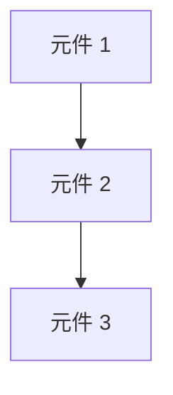

# 依賴分析報告

> 功能：{feature-id}
> 生成時間：{timestamp}

## 1. 元件清單

| ID | 元件 | 類型 | 說明 |
|----|------|------|------|
| C1 | 元件名稱 | 新建/修改 | 元件說明 |

## 2. 依賴矩陣

|    | C1 | C2 | C3 |
|----|----|----|----|
| C1 | -  |    |    |
| C2 |    | -  |    |
| C3 |    |    | -  |

圖例：
- → 表示「被依賴」
- ← 表示「依賴於」

## 3. 依賴圖



## 4. 依賴類型分析

### 硬依賴

| 來源 | 目標 | 說明 |
|------|------|------|
| C1 | C2 | C2 必須在 C1 之後 |

### 軟依賴

| 來源 | 目標 | 說明 |
|------|------|------|
| | | 建議順序，但可並行 |

### 資源依賴

| 資源 | 相關元件 | 說明 |
|------|----------|------|
| | | 共用資源限制 |

## 5. Wave 分組

### Wave 1（無依賴）

| 任務 | 說明 |
|------|------|
| | 可立即開始 |

### Wave 2（依賴 Wave 1）

| 任務 | 依賴 |
|------|------|
| | |

### Wave 3（依賴 Wave 2）

| 任務 | 依賴 |
|------|------|
| | |

## 6. 關鍵路徑

```
C1 → C2 → C3
```

**預估時長**：

## 7. 並行機會分析

| Wave | 可並行任務數 | 潛在節省 |
|------|-------------|----------|
| Wave 1 | | |
| Wave 2 | | |

## 8. 風險識別

### 依賴風險

| 風險 | 嚴重度 | 緩解 |
|------|--------|------|
| | | |

### 循環依賴檢查

- [ ] 無循環依賴

---

## 附錄：完整依賴列表

```yaml
dependencies:
  - source: C1
    target: C2
    type: hard
    reason: ""
```
